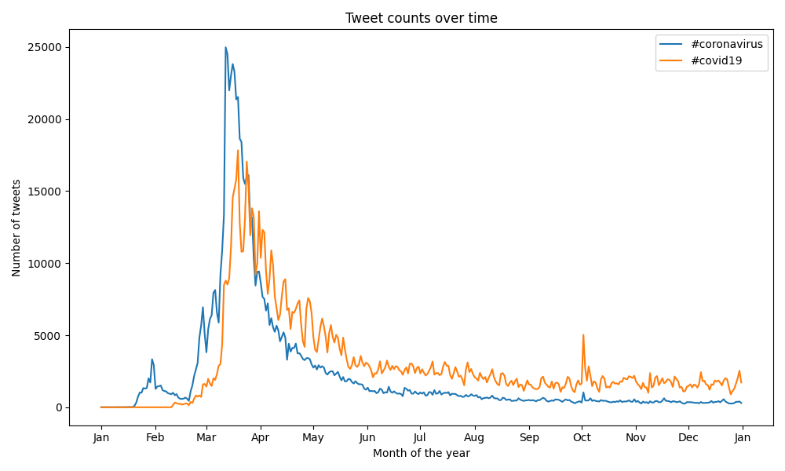
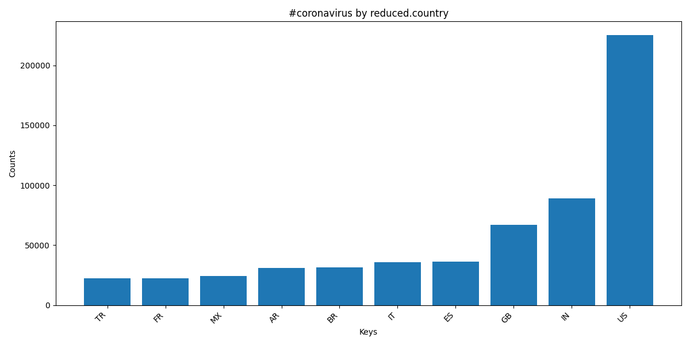
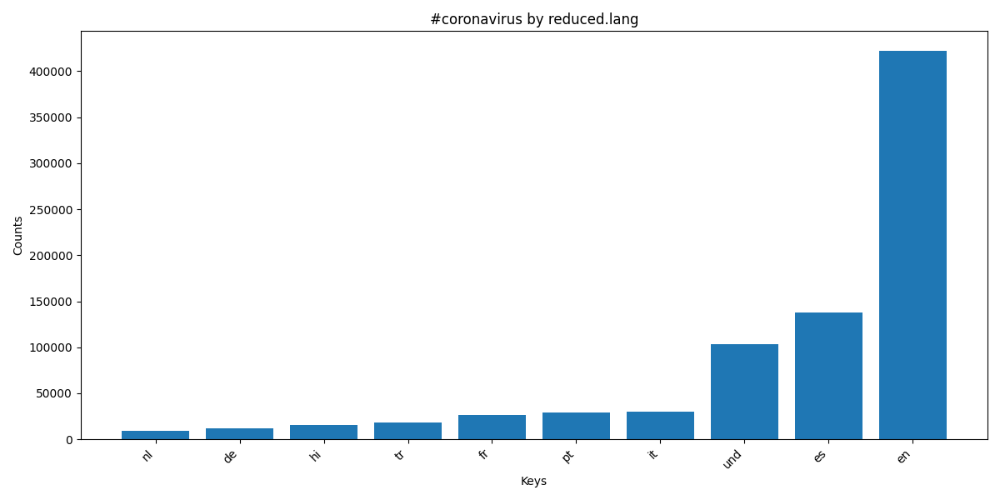
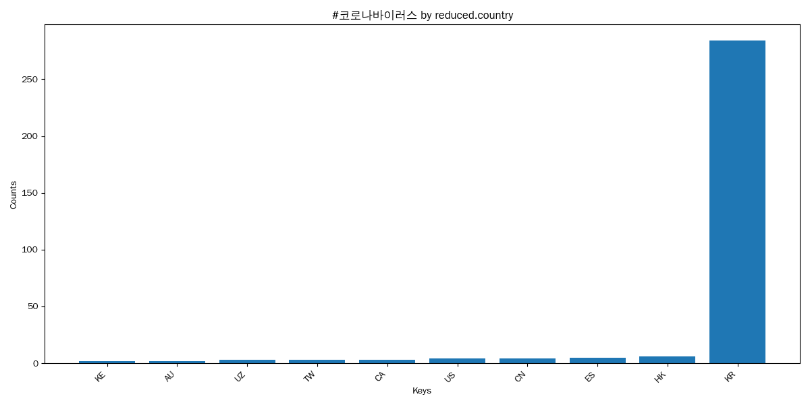
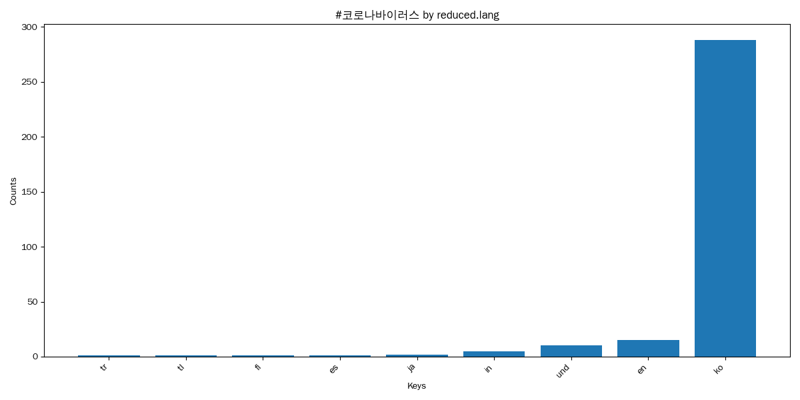

# Coronavirus Twitter Analysis 

## Project Overview
This project analyzes a massive dataset of approximately 1.1 billion geotagged tweets sent throughout 2020 to monitor the global spread and conversational trends surrounding the COVID-19 pandemic. This was done as a part of CMC's Big Data class!

By processing social media data at scale, this analysis highlights how different countries and linguistic demographics reacted to the virus over time, tracking the adoption of various hashtags like `#coronavirus`, `#covid19`, and `#코로나바이러스`.

## Technical Approach
To handle the scale of the dataset (hourly JSON files compressed into daily zip archives), I implemented a  **MapReduce** pipeline using Python and shell scripting:

1. **Map Phase (`map.py`):** I utilized a divide-and-conquer approach to process the daily data in parallel. The mapper scans the raw JSON tweets, extracts geographic and linguistic metadata, and tracks the frequency of specific COVID-related hashtags. 
2. **Parallel Execution (`run_maps.sh`):** Bash scripting, utilizing `nohup` and background processes (`&`), was used to execute the mapping functions concurrently across the lambda server (server students are given access to that contains these HUGE datasets and computer power), vastly reducing total processing time.
3. **Reduce Phase (`reduce.py`):** A reducer script aggregates the massive volume of individual daily outputs into consolidated `.lang` and `.country` dictionaries.
4. **Visualization (`visualize.py` & `alternative_reduce.py`):** The final aggregated data was visualized using `matplotlib` to generate both time-series analyses and categorical bar charts.

## Results & Visualizations

### 1. Hashtag Usage Over Time
This time-series plot tracks the usage of `#coronavirus` vs. `#covid19` throughout the year 2020. Noticeably, `#coronavirus` spiked massively early in the year, whereas `#covid19` gained traction slightly later as the official WHO terminology became widespread.

### 2. Geographic & Linguistic Distribution of `#coronavirus`
These charts display the top 10 countries and languages using the English `#coronavirus` hashtag.

**By Country:**

**By Language:**

### 3. Geographic & Linguistic Distribution of `#코로나바이러스`
These charts display the distribution for the Korean hashtag `#코로나바이러스`, demonstrating the localization of social media trends.

**By Country:**

**By Language:**

